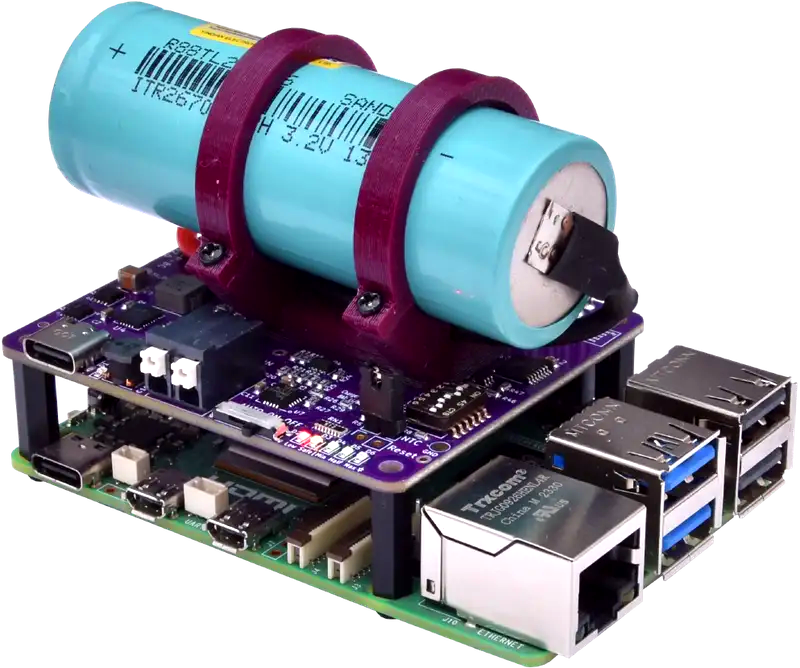

# AQEX Stubborn UPS Family @ Raspberry Pi and Pi Zero

<br>


  

Welcome to the official repository for the **Stubborn** Raspberry Pi UPS HAT family. This product line provides reliable uninterruptible power supply solutions for Raspberry Pi devices, featuring three main product lines: Eternal, Balance, and Stamina.

## Table of Contents
- [Product Overview](#product-overview)
- [Features](#features)
- [Installation](#installation)
- [Documentation](#documentation)
- [Contributing](#contributing)
- [License](#license)

## Product Overview

The Stubborn family offers different energy storage solutions:

- **Eternal**: Supercapacitor-based UPS with instant backup and exceptional cycle life
- **Balance**: Hybrid capacitor solution balancing performance and capacity
- **Stamina**: Advanced battery-based UPS with multiple chemistry options:
  - **LF**: LiFePO4 battery for extended runtime and safety
  - **NA**: Sodium-ion battery for cost-effective long-term storage
  - **MAX**: Multichem battery for maximum capacity and performance

## Features

- ✅ Instant backup with supercapacitors (Eternal)
- ✅ Balanced performance and capacity (Balance)  
- ✅ Multiple battery chemistries (Stamina)
- ✅ GPIO-based monitoring and shutdown
- ✅ Event-driven C driver and polling Python driver

## Installation

1. Choose your Stubborn model based on your power requirements
2. Review the [user manual](./docs/user-manual/) for installation instructions
3. Use the appropriate [driver code](./code/) for your preferred language
4. Check [compliance documentation](./docs/compliance/) for certifications

## Documentation

- [User Manual](./docs/user-manual/)
- [Technical Datasheet](./docs/technical-datasheet/)
- [Compliance & Certifications](./docs/compliance/)
- [Product Wiki](./docs/wiki/)

## Code Examples

See the [`code/`](./code/) directory for C and Python drivers based on qups-guard from aqexhu/qups-guard:
- C: qups-guard2 (event-driven GPIO monitoring)
- Python: qups-guard.py (polling GPIO monitoring)

## Quick Start

```bash
# Clone the repo
git clone https://github.com/aqexhu/stubborn.git

# Rund the guard software
stubborn/src/c/qups-guard2 --dip 01
```

## Contributing

We welcome contributions to improve the Stubborn ecosystem. Please see our contribution guidelines in the wiki.

## License

This project is licensed under the terms specified in [LICENSE](./LICENSE).

## Support

For support, questions, or feedback:
- Check the [product wiki](./docs/wiki/)
- Visit our [website](./website/)
- Contact our support team

## Product Images

### Assembled on Raspberry Pi

