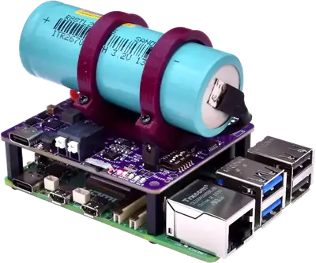
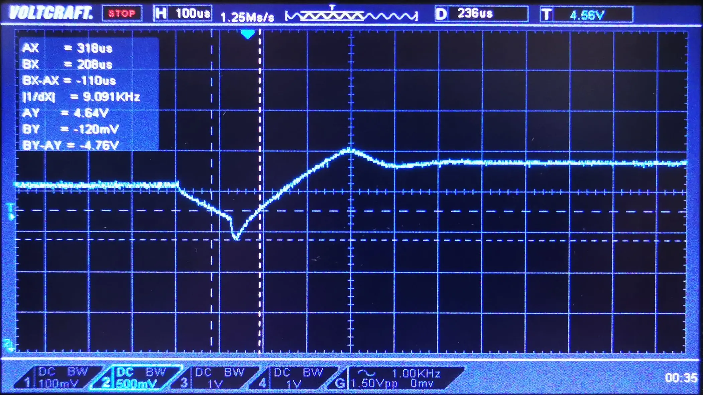
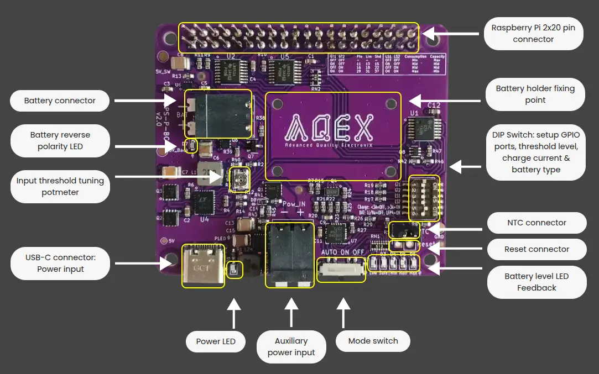

# Technical Data Sheet: qUPS-P-BC v2.0
### Smart Battery-Buffered UPS HAT for Raspberry Pi
**Official Product Page:** [https://aqex.eu/qups-p-bc-raspberry-pi-ups-hat-with-battery.html](https://aqex.eu/qups-p-bc-raspberry-pi-ups-hat-with-battery.html)

  

 

## 1. Product Concept & Strategic Advantages
The **qUPS-P-BC** is a professional-grade uninterruptible power supply designed to provide extended backup runtimes for Raspberry Pi and other 5V DC devices. Unlike supercapacitor-based solutions, the battery-buffered topology of the qUPS-P-BC allows for hours or even days of operation during a power outage, depending on the connected battery capacity.

Key strategic advantages include:
* **Multi-Chemistry Support:** Native compatibility with Li-ion, Li-Po, LiFePo4, and Sodium-ion batteries.
* **Intelligent AUTO Mode:** Features "Safe-Start" logic that only powers the Pi when sufficient energy is available for a complete boot and safe shutdown cycle.
* **Industrial Input Range:** Supports high-voltage external input (up to 28V) via industrial terminals.
* **Deep Discharge Protection:** Integrated safety circuits prevent battery damage by disconnecting the load at critical voltage levels.

## 2. Comprehensive Technical Specifications

| Parameter | Value | Condition / Detailed Notes |
| :--- | :--- | :--- |
| **Input Voltage (USB-C)** | 5.0V – 5.2V | Standard 5V PSU (min. 3A recommended) |
| **Input Voltage (Terminal)** | **5.2V – 28.0V DC** | Polarity protected industrial input |
| **Output Voltage** | 5.0V – 5.2V DC | Directly follows Pi power specifications |
| **Max Continuous Load** | 3.5A (17.5W) | Optimized for RPi 4 and RPi 5 |
| **Max Battery Discharge** | **7.5A** | Maximum current drawn from the battery |
| **Charging Current** | 1A or 2A | User-selectable via DIP switch |
| **Switchover Time** | 100 – 300 μs | Near-instantaneous seamless transition |

 

> **Design Note:** The **Offline topology** ensures almost zero power loss and heat generation during standard operation. A momentary (<1ms) voltage transient occurs during power failure; however, the Raspberry Pi's internal regulation easily filters this, ensuring zero system instability or reboot.

  

## 3. qUPS-P-SC User Interfaces and Indicators

  

   

## 4. Supported Battery Technologies & Charging
| Battery Type | Nominal Range | Charging Temp. Range |
| :--- | :--- | :--- |
| **Li-Ion / Li-Po** | 3.0V – 4.2V | 0°C to +40°C |
| **LiFePo4** | 2.5V – 3.6V | -20°C to +60°C |
| **Sodium-ion** | 1.8V – 4.0V | -30°C to +60°C |

> **Design Note:** For industrial environments or extreme temperatures, **LiFePo4** or **Sodium-ion** chemistry is highly recommended due to superior thermal stability.

## 5. GPIO Communication & DIP Switch Setup
The qUPS-P-BC features a flexible **GPIO Bank Selection** system via onboard **GT1-GT2 DIP switches** to prevent hardware conflicts with other HATs.

| GT1 Switch | GT2 Switch | Power Good (PFO) | Battery Limit (LIM) | Shutdown (SHD) |
| :--- | :--- | :--- | :--- | :--- |
| **OFF** | **OFF** | Disabled | Disabled | Disabled |
| **ON** | **OFF** | **GPIO 17** (Pin 11) | **GPIO 27** (Pin 13) | **GPIO 22** (Pin 15) |
| **OFF** | **ON** | **GPIO 23** (Pin 16) | **GPIO 24** (Pin 18) | **GPIO 25** (Pin 22) |
| **ON** | **ON** | **GPIO 5** (Pin 29) | **GPIO 6** (Pin 31) | **GPIO 26** (Pin 37) |

* **PFO (Power Fail Out):** HIGH = External Power OK / LOW = Backup Mode active.
* **LIM (Limit):** Signals that the battery has reached the "Safe" threshold (Yellow LED).
* **SHD (Shutdown):** Handshake signal. Pull LOW after OS halt to cut output power.

---

## 6. Visual Diagnostics (LED Group)
| LED | Color | Status / Meaning |
| :--- | :--- | :--- |
| **External Power** | **Green** | Primary power source detected on input. |
| **Bad Polarity** | **Red** | **CRITICAL:** Battery connected with reverse polarity! |
| **Max** | Green | Battery fully charged. |
| **Min** | Green | Sufficient energy for Boot + Shutdown cycle. |
| **Safe** | Yellow | Critical threshold; initiate OS shutdown. |
| **Low** | Red | **Battery depleted.** Power-off is imminent. |

---

## 7. Intelligent Power Management (IPM)
* **Safe-Start Logic:** In AUTO mode, the Pi only boots when the "Min" threshold is reached.
* **Anti-Reboot Loop:** Prevents "zombie" restart cycles during brownouts.
* **Threshold Tuning:** A precision potentiometer allows manual calibration of the power-fail detection level to compensate for voltage drops in long cables.

## 8. Estimated Runtimes (4000mAh LiFePo4)
| Raspberry Pi Model | No Load [min] | 50% Load [min] | 100% Load [min] |
| :--- | :---: | :---: | :---: |
| Raspberry Pi 2 | 530 | 365 | 280 |
| Raspberry Pi 3 | 450 | 250 | 220 |
| Raspberry Pi 4 | 312 | 190 | 144 |
| **Raspberry Pi 5** | **304** | **168** | **114** |

*\*Note: Final runtimes are dependent on battery capacity, age, and ambient temperature.*

---

## 9. Scalability & Software Support
* **Software Support:** Native `qups-guard` daemon (C/Python) for automated safe shutdown.
* **Repository:** [github.com/aqexhu/qups-guard](https://github.com/aqexhu/qups-guard)

---

**HW Version:** 2.0 | **Released:** 2024  
**Manufacturer:** AQEX Electronics | [aqex.eu](https://aqex.eu)