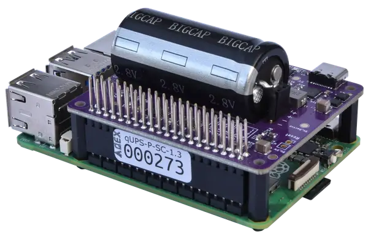
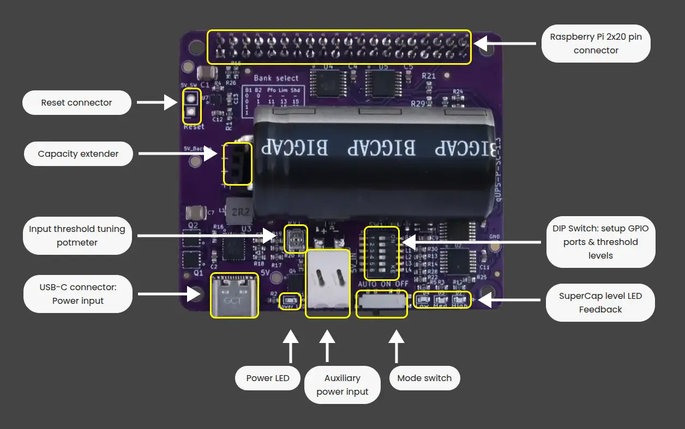

# Technical Data Sheet: qUPS-P-SC v1.3
### Industrial Ultra-High Capacity Supercapacitor UPS for Raspberry Pi
**Official Product Page:** [https://aqex.eu/qups-p-sc-raspberry-pi-ups-hat-with-supercapacitor.html](https://aqex.eu/qups-p-sc-raspberry-pi-ups-hat-with-supercapacitor.html)

  

  

## 1. Product Concept & Strategic Advantages
The **qUPS-P-SC** is a professional-grade, battery-less power protection solution engineered for the most demanding Raspberry Pi applications. In industrial environments, traditional battery-based UPS systems represent a significant failure point due to limited cycle life, chemical degradation, and extreme thermal sensitivity. 

The qUPS-P-SC eliminates these risks by utilizing a massive **100F - 120F supercapacitor array**, offering a virtually unlimited cycle life (>500,000) and maintenance-free operation for over a decade. Whether deployed in remote IoT gateways, edge computing nodes, or outdoor automation controllers, the qUPS-P-SC ensures data integrity through intelligent power-loss detection and automated safe shutdown procedures. Its wide operating temperature range (**-40°C to +65°C**) and robust **Offline topology** make it the definitive choice for mission-critical infrastructure where downtime or filesystem corruption is not an option.

## 2. Comprehensive Technical Specifications

| Parameter | Value | Condition / Detailed Notes |
| :--- | :--- | :--- |
| **Topology** | **Offline (Standby)** | **Maximum efficiency during normal operation** |
| **Input Voltage** | 5.0V – 5.2V | USB-C or Industrial Spring Terminal |
| **Output Voltage** | 5.2V DC | Precision regulated Step-Up for RPi 4/5 |
| **Total Capacitance** | **100F – 120F** | High-density EDLC (Supercapacitor) Array |
| **Max Continuous Load** | 2.5A | Optimized for high-performance RPi models |
| **Operating Temp** | **-40°C to +65°C** | **Full Industrial Grade** |
| **Switching Time** | 100 - 300 μs | Near-instantaneous transition |

 

> **Design Note:** The **Offline topology** ensures almost zero power loss and heat generation during standard operation. A momentary (<1ms) voltage transient occurs during power failure; however, the Raspberry Pi's internal regulation easily filters this, ensuring zero system instability or reboot.

  

## 3. qUPS-P-SC User Interfaces and Indicators

  

  

## 4. GPIO Communication & DIP Switch Setup
The qUPS-P-SC features a flexible **GPIO Bank Selection** system via onboard **B1-B2 DIP switches (2)** to prevent hardware conflicts with other HATs or peripherals.

| B1 Switch | B2 Switch | Power Good (PFO) | Cap. Low (LIM) | Shutdown (SHD) |
| :--- | :--- | :--- | :--- | :--- |
| **OFF** | **OFF** | Disabled | Disabled | Disabled |
| **ON** | **OFF** | **GPIO 17** (Pin 11) | **GPIO 27** (Pin 13) | **GPIO 22** (Pin 15) |
| **OFF** | **ON** | **GPIO 23** (Pin 16) | **GPIO 24** (Pin 18) | **GPIO 25** (Pin 22) |
| **ON** | **ON** | **GPIO 5** (Pin 29) | **GPIO 6** (Pin 31) | **GPIO 26** (Pin 37) |

* **PFO (Power Fail Out):** HIGH = External Power OK / LOW = Backup Mode active.
* **LIM (Limit):** Signals that the capacitor energy has reached a critical low threshold.
* **SHD (Shutdown):** Command from RPi to UPS. Pull LOW after OS halt to cut output power.

## 5. Control & Runtime Optimization

### Input Level Threshold Adjustment (Potmeter):
Tune the exact voltage point where the UPS triggers the transition from external power to supercapacitor backup. This is critical for:
* **Long Input Cables:** Compensating for voltage drops (IR drop) in industrial wiring.
* **Weak Power Sources:** Preventing premature switching during minor voltage ripples.

### Adjustable Detection Thresholds (DIP)
A precision potentiometer allows for **manual calibration of power-fail detection and switching levels**. This empowers engineers to:
* **Maximize Backup Time:** Fine-tune the "empty" threshold to extract every joule of stored energy.
* **Compensate for Voltage Drop:** Adjust for resistive losses in long or thin input cables.
* **Filter Power Noise:** Prevent false triggers during the high-current bursts typical of Raspberry Pi 5.

### Visual Diagnostics (LED Group)
| LED | Color | Status |
| :--- | :--- | :--- |
| **External Power** | **Green** | Primary 5V power source detected on input. |
| **High** | Green | Full charge. System is safe for Boot + Shutdown cycle. |
| **Med** | Yellow | Medium charge. Sufficient energy for an emergency OS shutdown. |
| **Low** | Red | **Critical energy.** Power-off is imminent. |

---
 

## 6. Intelligent Power Management (IPM)
* **Safe-Start Logic:** Prevents the Pi from booting until the energy level reaches the "High" (Green LED) threshold.
* **Anti-Reboot Loop:** Actively prevents "zombie" restart cycles during brownouts or low-energy states.
* **Shutdown Guard:** Ensures the OS halt process completes even if external power returns mid-process, preventing filesystem corruption.

## 7. Operational Dynamics & Runtime (120F)

| Raspberry Pi Model | No Load [s] | 50% Load [s] | 100% Load [s] |
| :--- | :---: | :---: | :---: |
| Raspberry Pi 2 | 168 | 148 | 80 |
| Raspberry Pi 3 | 171 | 70 | 41 |
| Raspberry Pi 4 | 84 | 44 | 29 |
| **Raspberry Pi 5** | **74** | **20** | **8** |

*\*Note: Final runtimes can be significantly extended via user-calibrated threshold settings and software optimization.*

---
 

## 8. Scalability & Software Support
* **Modular Expansion:** Supports **qUPS-P-EX** extender modules (EX450, EX900, EX1700) via the dedicated capacity interface.
* **Software Support:** Native C++/Python `qups-guard` daemon for background monitoring and automated safe shutdown.
* **Repository:** [github.com/aqexhu/qups-guard](https://github.com/aqexhu/qups-guard)

---

 

**HW Version:** 1.3 | **Released:** 2024  
**Manufacturer:** AQEX Electronics | [aqex.eu](https://aqex.eu)