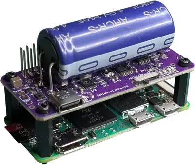
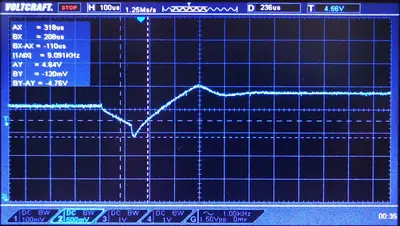
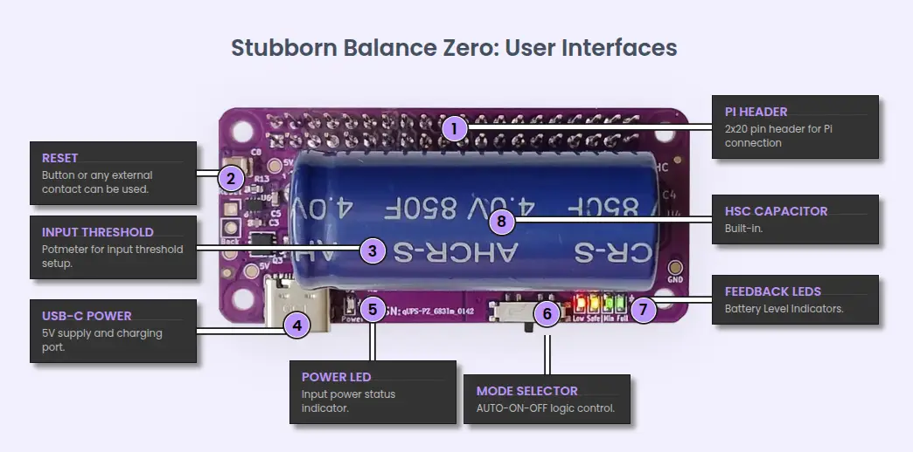

<title>Stubborn Balance Zero technical datasheet</title>

# Technical Data Sheet: Stubborn Balance Zero v1.0
### Ultra-Durable Maintenance-Free Hybrid Supercapacitor UPS HAT for Raspberry Pi Zero
**Official Product Page:** [https://www.aqex.eu/stubborn-balance-zero-raspberry-pi-zero-ups-hat-hybrid-supercap.html](https://www.aqex.eu/stubborn-balance-zero-raspberry-pi-zero-ups-hat-hybrid-supercap.html)

 

 

## 1. Product Concept & Strategic Advantages
The **Stubborn Balance Zero** is a specialized uninterruptible power supply designed for the **Raspberry Pi Zero** family. Unlike traditional battery-based systems, it utilizes **Hybrid Supercapacitor (HSC)** technology to provide a maintenance-free, high-endurance power backup solution for industrial and remote IoT applications.

Strategic advantages:
* **Extended Runtime:** Offers significantly higher energy density and longer backup power duration compared to standard supercapacitors.
* **Extreme Longevity:** The HSC technology supports up to 50,000 charge cycles, outlasting traditional Li-ion batteries.
* **Maintenance-Free:** No chemical aging typical of batteries; ideal for hard-to-reach deployments.
* **Superior Temperature Stability:** Operates reliably in environments where standard batteries would fail.
* **Compact Form Factor:** Designed specifically to match the Raspberry Pi Zero's footprint.
* **Zero Maintenance:** No periodic battery replacements required during the typical lifecycle of the equipment.

## 2. Comprehensive Technical Specifications

| Parameter | Value | Condition / Detailed Notes |
| :--- | :--- | :--- |
| **Input Voltage (USB-C)** | 5.0V – 5.2V | Minimum 2A - 3A recommended |
| **Output Voltage** | 5.0V DC | Regulated for Raspberry Pi Zero |
| **Storage Technology** | Hybrid Supercapacitor | High energy density with long cycle life |
| **Max Continuous Load** | **3.5A** | Enhanced current delivery for RPi 5 + Peripherals |
| **Cycle Life** | ~50,000 Cycles | Industrial grade durability |
| **GPIO Interface** | 40-pin Header | Pass-through design for stacking |
| **Switchover Time** | 100 – 300 μs | No-reboot guaranteed transition |

 

> **Design Note:** The **Offline topology** ensures almost zero power loss and heat generation during standard operation. A momentary (<1ms) voltage transient occurs during power failure; however, the Raspberry Pi's internal regulation easily filters this, ensuring zero system instability or reboot.

 

## 3. qUPS-P-SC User Interfaces and Indicators

  

   

## 4. Power Management & Protection
| Feature | Specification |
| :--- | :--- |
| **Logic Control** | Hardware-level voltage monitoring |
| **Safety** | Protected against over-discharge and input voltage fluctuations |
| **Input Tuning** | Potentiometer for input threshold calibration |
| **Restart Logic** | Automatic recovery after power restoration in AUTO mode |

## 5. User Interfaces & Configuration
### 5.1 Mode Selection (Switch 4)
* **OFF:** Complete power cut.
* **ON:** Immediate power-up when power (internal or external) is available.
* **AUTO:** Intelligent start-up logic; only boots the Pi when the battery reaches the "Min" energy level.

### 5.2 GPIO Communication
The system utilizes a 3-pin GPIO interface for OS-level integration. The following pins are used on the 40-pin Raspberry Pi header:

* **PFO (Power Fail):** **GPIO 17 (Pin 11)** — Signals external power loss (HIGH = OK / LOW = Backup Mode).
* **LIM (Limit):** **GPIO 27 (Pin 13)** — Signals that the battery has reached the critical low threshold.
* **SHD (Shutdown):** **GPIO 22 (Pin 15)** — Handshake signal. The UPS cuts power after the OS pulls this pin LOW (or the daemon signals a halt).

 

## 6. Visual Diagnostics (LED Indicators)
| LED | Color | Status / Meaning |
| :--- | :--- | :--- |
| **External Power** | **Green** | Primary 5V power source detected. |
| **Full** | Green | Battery fully charged (>3.9V). |
| **Min** | Green | Sufficient energy for a safe boot-shutdown cycle. |
| **Safe** | Yellow | Sufficient energy for a safe shutdown cycle. |
| **Low** | Red | **Critical level.** Immediate shutdown required. |

 

## 7. Intelligent Power Management (IPM)
* **Safe-Start Logic:** Prevents "brown-out" loops by ensuring the Pi only starts when the battery can support the peak current of the boot process.
* **Shutdown Guard:** Monitors the Pi's state and ensures power is only cut after the operating system has safely unmounted the filesystem.
* **Input Threshold Tuning:** Onboard potentiometer allows adjustment for voltage drops caused by long input cables.

## 8. Estimated Runtimes with Raspberry Pi Zero2 WH

| HSC Capacity | No Load |  100% Load |
| :--- | :--- | :--- |
| **450F** | 46 min | 13 min |
| **850F** | 60 min | 22 min |
| **1100F** | 105 min | 28 min |

 

## 9. Software Support
* **qups-guard:** Native **open-source** daemon for automated monitoring and safe shutdown.
* **Compatibility:** Fully compatible with Raspberry Pi OS (Debian-based).
* **Repository:** [github.com/aqexhu/qups-guard](https://github.com/aqexhu/qups-guard)

---

**HW Version:** 1.0 | **Released:** 2025
**Manufacturer:** AQEX Electronics | [aqex.eu](https://aqex.eu)